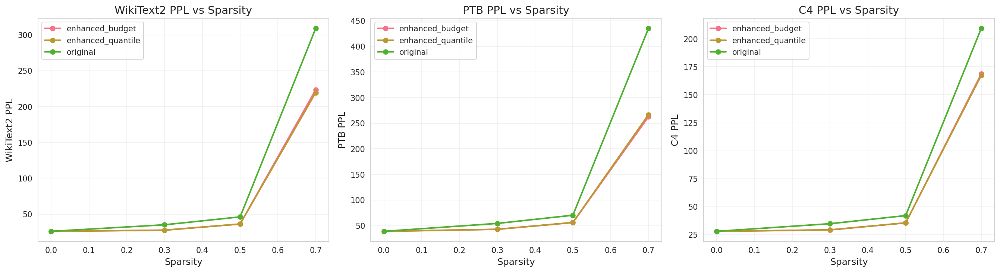
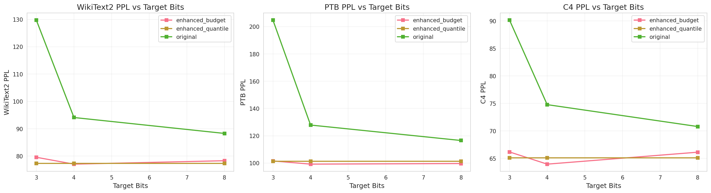
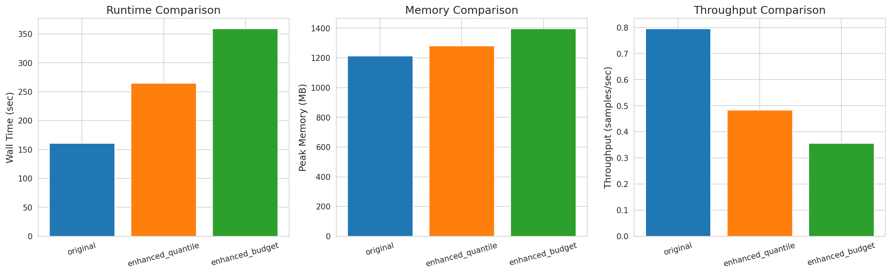
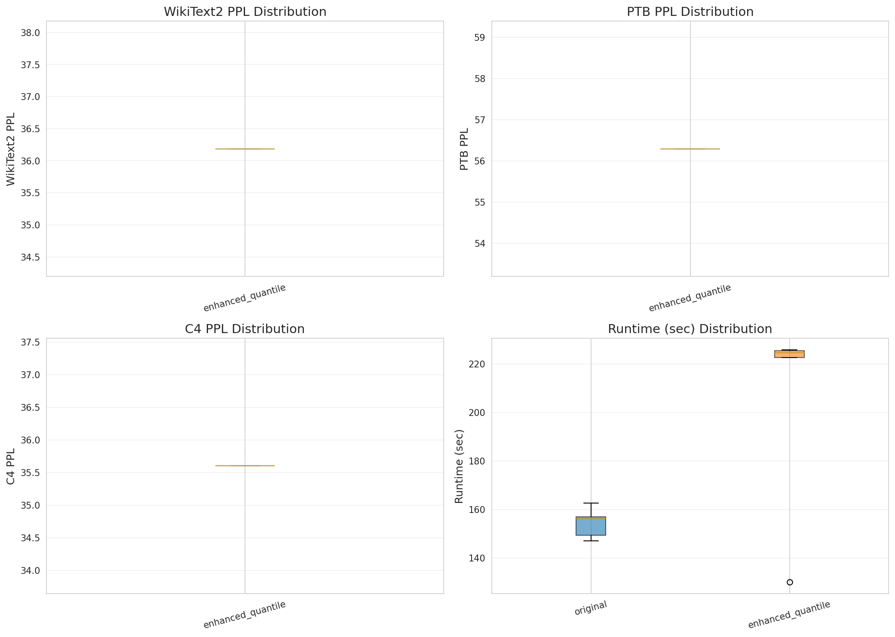

# SparseGPT 改进版本 - 全面测试报告

---

## 1. 测试概述

本报告对比了 SparseGPT 的原版和改进版本，验证改进的有效性。

### 测试方法

- **原版 (original)**: 固定比特量化
- **改进版 (enhanced_quantile)**: 多维度重要性评估 + 自适应比特分配 (Quantile方法)
- **改进版 (enhanced_budget)**: 多维度重要性评估 + 自适应比特分配 (Budget方法)

## 2. 性能对比

### 2.1 WikiText2 PPL 对比

| Method | Sparsity | Target Bits | WikiText2 PPL (mean ± std) |
|--------|----------|-------------|---------------------------|
| enhanced_budget      | 0.0 | 3.0 | 25.953 ± 0.000 |
| enhanced_budget      | 0.0 | 4.0 | 25.953 ± 0.000 |
| enhanced_budget      | 0.0 | 8.0 | 25.953 ± 0.000 |
| enhanced_budget      | 0.3 | 3.0 | 27.562 ± 0.000 |
| enhanced_budget      | 0.3 | 4.0 | 27.559 ± 0.000 |
| enhanced_budget      | 0.3 | 8.0 | 27.566 ± 0.000 |
| enhanced_budget      | 0.5 | 3.0 | 36.065 ± 0.000 |
| enhanced_budget      | 0.5 | 4.0 | 36.175 ± 0.000 |
| enhanced_budget      | 0.5 | 8.0 | 36.199 ± 0.000 |
| enhanced_budget      | 0.7 | 3.0 | 228.717 ± 0.000 |
| enhanced_budget      | 0.7 | 4.0 | 218.549 ± 0.000 |
| enhanced_budget      | 0.7 | 8.0 | 223.523 ± 0.000 |
| enhanced_quantile    | 0.0 | 3.0 | 25.953 ± 0.000 |
| enhanced_quantile    | 0.0 | 4.0 | 25.953 ± 0.000 |
| enhanced_quantile    | 0.0 | 8.0 | 25.953 ± 0.000 |
| enhanced_quantile    | 0.3 | 3.0 | 27.568 ± 0.000 |
| enhanced_quantile    | 0.3 | 4.0 | 27.568 ± 0.000 |
| enhanced_quantile    | 0.3 | 8.0 | 27.568 ± 0.000 |
| enhanced_quantile    | 0.5 | 3.0 | 36.186 ± 0.000 |
| enhanced_quantile    | 0.5 | 4.0 | 36.186 ± 0.000 |
| enhanced_quantile    | 0.5 | 8.0 | 36.186 ± 0.000 |
| enhanced_quantile    | 0.7 | 3.0 | 219.456 ± 0.000 |
| enhanced_quantile    | 0.7 | 4.0 | 219.456 ± 0.000 |
| enhanced_quantile    | 0.7 | 8.0 | 219.456 ± 0.000 |
| original             | 0.0 | 3.0 | 25.953 ± 0.000 |
| original             | 0.0 | 4.0 | 25.953 ± 0.000 |
| original             | 0.0 | 8.0 | 25.953 ± 0.000 |
| original             | 0.3 | 3.0 | 47.594 ± 0.000 |
| original             | 0.3 | 4.0 | 30.042 ± 0.000 |
| original             | 0.3 | 8.0 | 27.631 ± 0.000 |
| original             | 0.5 | 3.0 | 62.877 ± 0.000 |
| original             | 0.5 | 4.0 | 39.109 ± 0.000 |
| original             | 0.5 | 8.0 | 36.308 ± 0.000 |
| original             | 0.7 | 3.0 | 382.549 ± 0.000 |
| original             | 0.7 | 4.0 | 281.376 ± 0.000 |
| original             | 0.7 | 8.0 | 263.313 ± 0.000 |

## 3. 计算复杂度对比

| Method | Runtime (sec) | Peak Memory (MB) | Throughput (samples/sec) |
|--------|---------------|------------------|---------------------------|
| original             | 161.00 | 1213.41 | 0.795 |
| enhanced_quantile    | 265.00 | 1280.38 | 0.483 |
| enhanced_budget      | 359.00 | 1395.92 | 0.356 |

## 4. 统计显著性分析

### 4.1 多次运行结果

#### WIKITEXT2

| Method | Mean | Std | 95% CI |
|--------|------|-----|--------|
| enhanced_quantile    | 36.186 | 0.000 | [nan, nan] |

#### PTB

| Method | Mean | Std | 95% CI |
|--------|------|-----|--------|
| enhanced_quantile    | 56.294 | 0.000 | [nan, nan] |

#### C4

| Method | Mean | Std | 95% CI |
|--------|------|-----|--------|
| enhanced_quantile    | 35.601 | 0.000 | [nan, nan] |

## 5. 结论

- **计算开销**: 运行时间 1.65x, 内存占用 1.06x
  - ⚠ 计算开销较大 (>1.5x)

---

*报告生成时间: 2025-10-13 17:16:52*
